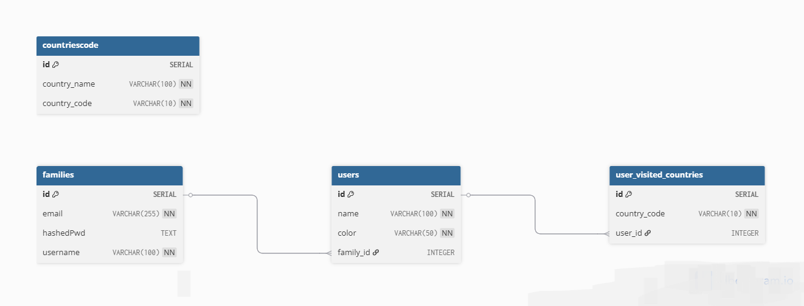

# 🌍 Travella

**Travella** is a full-stack web application that lets families **track their travels**, **record visited countries**, and **share memories together** on an interactive map.

## 🚀 Features

- 👨‍👩‍👧‍👦 Family-based user management
- 📍 Track visited countries per user
- 🗺️ Interactive dashboard map
- 🔐 Authentication (Email/Password + Google OAuth)

## 🔧 Tech Stack

**Frontend:**
- HTML, CSS, JavaScript, EJS Templates

**Backend:**
- Node.js, Express.js

**Database:**
- PostgreSQL

**Authentication:**
- Bcrypt (email-password)
- Google OAuth 2.0 (Passport.js)

## 🗃️ Database Schema (ER Diagram)

